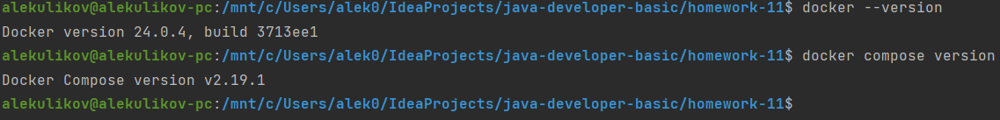
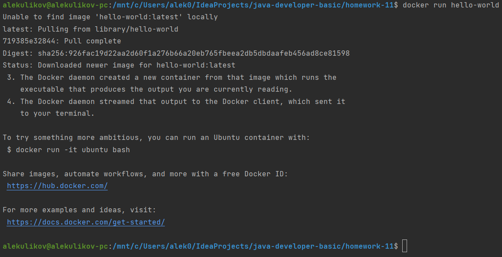
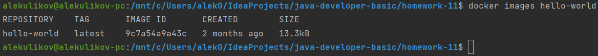
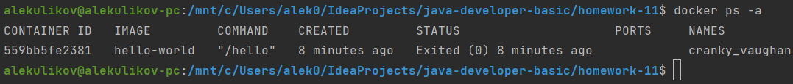
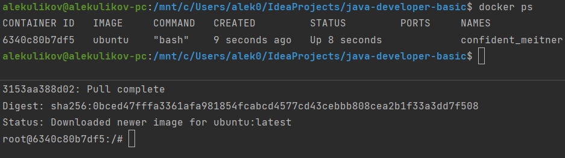
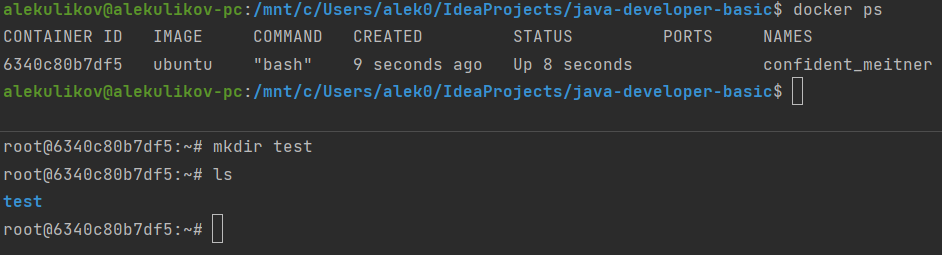
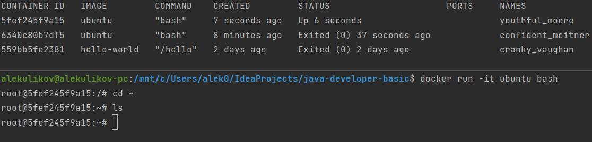
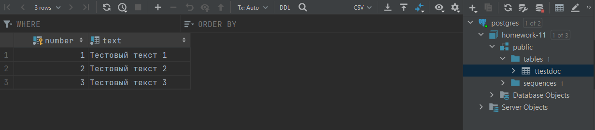
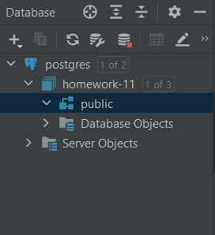

## Знакомство с Docker
### Цель упражнения - получить базовые навыки работы с Docker.
1) Docker был установлен. Чтобы убедиться в этом, нужно ввести команды:
```shell
docker --version
docker compose version
```

2) Чтобы проверить работу docker, была выполнена команда
```shell
docker run hello-world
```

3) Проверим, что размер образа hello-world равен 13.3kB
```shell
docker images hello-world
```

4) Убедимся, что сейчас нет запущенных контейнеров
```shell
docker ps -a
```

5) Запустим контейнер из образа ubuntu и снова проверим запущенные контейнеры
```shell
docker run -it ubuntu bash
docker ps
```

6) Создадим каталог test в домашней директории
```shell
cd ~
mkdir test
ls
```

7) Запустим новый контейнер из образа ubuntu и убедимся, что созданного в другом контейнера каталога в нем нет.
Это произошло, потому что слой данных, в котором можно вносить изменения, является уникальным для каждого контейнера 
и не влияет на образ
```shell
docker run -it ubuntu bash
cd ~
ls
```

8) Запустим postgres и передадим ему sql-скрипты для инициализации БД
```shell
docker run --name postgres1 -e POSTGRES_PASSWORD=postgres -e POSTGRES_USER=postgres \
-e POSTGRES_DB=homework-11 -v $(pwd)/resources/databasescripts:/docker-entrypoint-initdb.d \
-p 5432:5432 -d postgres:14.7
```

9) Остановим и удалим контейнер postgres1, а затем запустим новый контейнер postgres2 без инициализации.
Таблица отсутствует, потому что мы создали новый контейнер со своим слоем данных поверх образа
```shell
docker stop $(docker ps -q)
docker rm $(docker ps -aq)
docker run --name postgres2 -e POSTGRES_PASSWORD=postgres -e POSTGRES_USER=postgres \
-e POSTGRES_DB=homework-11 -p 5432:5432 -d postgres:14.7
```

